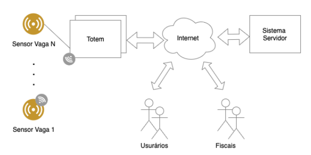
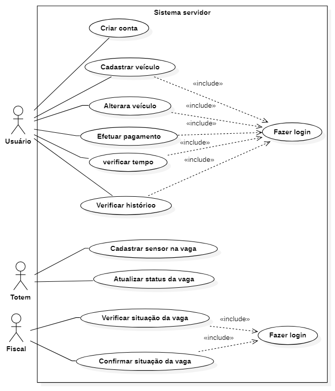
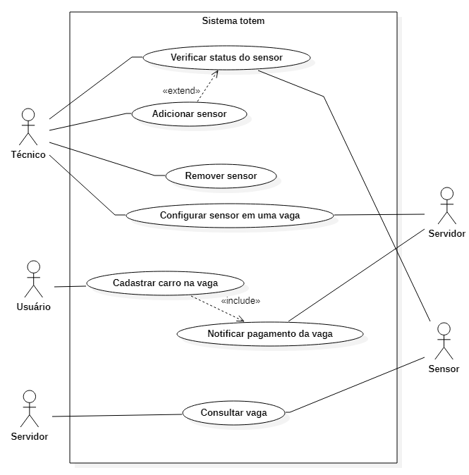

Tabela de conteúdos
=================
<!--ts-->
   * [Requisitos inicias do projeto](#Requisitos-iniciais)  
   * [Leventamento de requisitos](#Requisitos-funcionais)
      * [Requisitos do Servidor](#Requisitos-funcionais-servidor)
      * [Requisitos do Totem](#Requisitos-funcionis-totem)
   * [Regras de negócio](#Regras-de-negócio)
   * [Diagrama de casos de uso](#Diagramas-de-casos-de-uso)
      * [Diagrama de casos de uso lado servidor](#Diagrama-de-casos-de-uso-do-servidor)
      * [Diagrama de casos de uso lado totem](#Diagrama-de-casos-de-uso-do-totem)
   * [Descrição de casos de uso do servidor](#Descrição-de-casos-de-uso-do-sistema-servidor)
   * [Descrição de casos de uso do totem](#Descrição-de-casos-de-uso-do-totem)
<!--te-->

## Proposta do Projeto da disciplina PJI029006 

   

Sistema de estacionamento "zona azul" para uma cidade.

### Requisitos iniciais:
* Prever a possibilidade de vários totems para cobrir a * cidade toda.
* O usuário pode fazer o pagamento no Totem ou por meio digital usando o smartphone.
* Os sensores podem ser com fio ou sem fio.
* O totem deve prover uma interface de serviço para adição, configuração e remoção de
sensores.
*  O sistema servidor deve:
   * Reportar o número de vagas ocupadas; 
   * Localização de  vagas na cidade;
   * Gerar sinais de alerta para os fiscais; 
   * Informações para usuário sobre o tempo
   decorrido;
   * Gerar alerta de tempo expirado

## Requisitos Funcionais

<h4 align="center"> 
	🚧 Em construção...  🚧
</h4>

### Requisitos funcionais servidor:
* **R1.** Servidor de informar o número de vagas ocupadas 
* **R2.** Servidor deve localizar vagas na cidade 
* **R3.** Servidor deve gerar notificações para os fiscais caso haja alguma vaga com tempo excedido
* **R4.** Servidor deve gerar notificação de tempo expirando para o usuário
* **R5.** Servidor deve gerar notificação para o técnico se algum sensor estiver inoperante
* **R6.** Permitir o usuário criar uma conta
* **R7.** Permitir o usuário se autenticar no sistema
* **R8.** Permitir o usuário Cadastrar um veículo
* **R9.** Permitir o usuário Alterar veículo do cadastrado
* **R10.** Permitir o usuário Efetuar pagamento
* **R11.** Permitir o usuário Renovar vaga em uso
* **R12.** Permitir o usuário Verificar tempo decorrido
* **R13.** Permitir o usuário ver histórico de pagamentos
* **R14.** Permitir o fiscal se autenticar no sistema
* **R15.** Permitir o fiscal a verificar status do veículo
* **R16.** Permitir o fiscal gerar notificação de não conformidade para o veículo
* **R17.** Permitir o Totem cadastrar os sensores no servidor
### Requisitos funcionis totem
* **R18.** Permitir o técnico a logar no sistema de manutenção
* **R19.** Permitir o técnico adicionar sensores
* **R20.** Permitir o técnico remover sensores
* **R21.** Permitir o técnico configurar sensores
* **R22.** Permitir o técnico verificar status dos sensores
* **R23.** Permitir o usuário cadastrar veículo na vaga
* **R24.** Permitir o usuário definir o tempo de estacionamento
* **R25.** Permitir o usuário efetuar pagamento
* **R26.** Permitir o servidor consultar status dos sensores 
* **R27.** Permitir o servidor consultar status das vagas

### Requisitos não funcionais
* **RNF00.** Aplicativo deve ser desenvolvido na linguagem Java
* **RNF01.** A interface do usuário deve ser simples e objetiva
* **RNF02.** Os sensores devem ser sem fio

## Regras de negócio.

<h4 align="center"> 
	🚧 Em construção...  🚧
</h4>

* **RN00:** Usuário não pode estacionar por mais de 2 horas por dia na mesma vaga
* **RN01:** Usuário só pode cadastrar 1 veículo
* **RN02:** Servidor deve notificar os usuário quando estiver faltando 10 minutos para acabar o seu tempo.
* **RN03:** Servidor deve bloquear o usuário se tiver 3 notificações no período de 1 mês.

## Diagramas de casos de uso

### Diagrama de casos de uso do servidor

   

### Diagrama de casos de uso do totem

   

## Descrição de casos de uso do sistema servidor

### Criar conta (CSU00) 

|  Sumário | Usuário abre o aplicativo e não tem uma conta válida para usar |
|---|---|
|Ator principal   |  Usuário |
|Ator secundrário   | Servidor  |
|Pré condição | N/A|
|Fluxo principal   | 1. Usuário abre o aplicativo e escolhe a opção criar conta  2. Sistema fornece o campo usuário, senha, email para usuário preencher   3. Usuário preenche os dados e clica em criar    4. Sistema válida os dados do usuário   5. Se estiver tudo certo, a conta é criada, e o caso de uso termina|
|Regras de negócio | N/A |
|Pós-condições| N/A |
### Cadastrar veículo  (CSU01)

| Sumário| Usuário vai cadastrar o seu veículo no sistema  |
|---|---|
|Ator principal   |  Usuário |
|Ator secundrário   |  Servidor |
|Pré condição | Usuário precisa estar logado no sistema |
|Fluxo principal   | 1. Usuário abre o aplicativo e escolhe a opção cadastrar veículo   2. Sistema irá fornecer o campo placa para usuário preencher   3. Sistema verifica se o carro já está cadastrado   4. Se estiver tudo certo, o sistema cadatra o veículo. Conforme [RN01](#Regras-de-negócio.), só poderá ter um veículo cadastrado, e o caso de uso termina.   5.   |
|Regras de negócio | RN01 |
|Pós-condições| N/A |

### Alterar veículo (CSU02)

| Sumário| Usuário vai alterar o veículo cadastrado no sistema |
|---|---|
|Ator principal   |  Usuário |
|Ator secundrário   |  Servidor |
|Pré condição | Usuário precisa estar logado no sistema |
|Fluxo principal   | 1. Usuário abre o aplicativo e escolhe a opção alterar veículo   2. Sistema irá fornecer o campo nova placa para usuário preencher   3. Sistema verifica se o carro já está cadastrado   4. Se estiver tudo certo, o sistema altera o veículo, e o caso de uso termina. |
|Regras de negócio | N/A |
|Pós-condições| N/A |

### Efetuar pagamento (CSU03)

| Sumário| Usuário vai efetuar pagamento para utilizar uma vaga|
|---|---|
|Ator principal   |  Usuário |
|Ator secundrário   |  Servidor |
|Pré condição | Usuário precisa estar logado no sistema e ter um carro cadastrado|
|Fluxo principal   | 1. Usuário abre o aplicativo e escolhe a opção efetuar pagamento   2. Sistema irá fornecer o campo tempo para o usuário preencher   3. Se for um tempo válido, sistema atribui o tempo ao carro cadastrado   4. Usuário escolhe a forma de pagamento   5. Sistema válida o pagamento a atualiza status da vaga, e o caso de uso termina| 
|Regras de negócio | N/A |
|Pós-condições| N/A |

### Verificar tempo (CSU04)

| Sumário| Usuário deseja verificar quanto tempo ainda tem disponível na vaga|
|---|---|
|Ator principal   |  Usuário |
|Ator secundrário   |  Servidor |
|Pré condição | Usuário precisa estar logado no sistema e ter um carro cadastrado|
|Fluxo principal   | 1. Usuário abre o aplicativo e escolhe a opção verificar tempo    2. Sistema irá mostrar o tempo que ainda tem disponível ao usuário, e o caso de uso termina   7
|Fluxo alternativo(1): Usuário deseja renovar o tempo da sua vaga |a. Sistema fornece a possibilidade do usuário definir um novo tempo para vaga   b. Se o usuário escolher a opção definir tempo, entrará no caso [CSU03](#Efetuar-pagamento-(CSU03))|
|Regras de negócio | N/A |
|Pós-condições| N/A |

### Verificar histórico (CSU05)

| Sumário| Usuário deseja verificar o histórico de estacionamento realizados|
|---|---|
|Ator principal   |  Usuário |
|Ator secundrário   |  Servidor |
|Pré condição | Usuário precisa estar logado no sistema|
|Fluxo principal   | 1. Usuário abre o aplicativo e escolhe a opção verificar histórico   2. Sistema irá mostrar os dados referente ao seu uso do estacionamento  3. Sistema fornece a opção de salvar como arquivo, e o caso de uso termina| 
|Regras de negócio | N/A |
|Pós-condições| N/A |

### Cadastrar sensor na vaga (CSU06)

| Sumário  |  Permite o totem cadastrar um novo sensor em uma vaga  |
|---|---|
|Ator principal   |  Totem |
|Atores secundrários   |  Servidor |
|Pré condição | N/A |
|Fluxo principal   | 1. Totem solicita ao servidor a opção de configurar um sensor em uma vaga   2. Sistema irá solicitar o identificar do sensor e em qual vaga deseja configurar   3. Sistema adiciona o sensor em uma vaga se ela não tiver sensor configurado, e o caso de uso termina|
|Regras de negócio | N/A |
|Pós-condições| N/A |

### Atualizar status da vaga  (CSU07)
| Sumário  |  Totem pode alterar sensor ou remover sensor de uma vaga  |
|---|---|
|Ator principal   | Totem  |
|Atores secundrários   | Servidor  |
|Pré condição | N/A |
|Fluxo principal   | 1. Totem solicta ao servidor a opção de atualizar status de uma vaga   2. Sistema fornece a opção de alterar um sensor de uma vaga   3. Sistema solicita o identificador do sensor atual e do novo   4. Se o novo sensor não estiver cadastrado em nenhuma vaga, é cadastrado e o caso de uso termina|
|Fluxo Alternativo(1): Totem deseja remover um sensor   | a. Sistema fornece a opção de remover um sensor de uma vaga   b. Sistema solicita o identificador do sensor a ser removido   c. Sistema remove o sensor da vaga, e o caso de uso termina|
|Regras de negócio | N/A |
|Pós-condições| N/A |

###  Verificar situação da vaga (CSU08)
| Sumário  |  Fiscal deseja consultar a situação de uma vaga |
|---|---|
|Ator principal   |  Fiscal |
|Atores secundrários   | Servidor  |
|Pré condição | Fiscal precisa estar logado no sistema|
|Fluxo principal   | 1. Fiscal solicita ao servidor a situação atual da vaga   2. Sistema informa se a vaga está válida ou inválida   3. Fiscal confirma se a informação está condizente   4. Sistema atualiza status da vaga caso não esteja de acordo, e o caso de uso termina|
|Regras de negócio | N/A |
|Pós-condições| Confirmar situação vaga |

## Descrição de casos de uso do totem

### Verificar status do sensor (CSU00)
| Sumário  |    |
|---|---|
|Ator principal   |   |
|Atores secundrários   |   |
|Pré condição | |
|Fluxo principal   | 1.   2.   3.   4.   5.   |
|Regras de negócio | |
|Pós-condições| |

### Adicionar sensor (CSU)
| Sumário  |    |
|---|---|
|Ator principal   |   |
|Atores secundrários   |   |
|Pré condição | |
|Fluxo principal   | 1.   2.   3.   4.   5.   |
|Regras de negócio | |
|Pós-condições| |

### Remover sensor (CSU)
| Sumário  |    |
|---|---|
|Ator principal   |   |
|Atores secundrários   |   |
|Pré condição | |
|Fluxo principal   | 1.   2.   3.   4.   5.   |
|Regras de negócio | |
|Pós-condições| |

### Configurar sensor (CSU)
| Sumário  |    |
|---|---|
|Ator principal   |   |
|Atores secundrários   |   |
|Pré condição | |
|Fluxo principal   | 1.   2.   3.   4.   5.   |
|Regras de negócio | |
|Pós-condições| |

### Cadastrar carro na vaga (CSU)
| Sumário  |    |
|---|---|
|Ator principal   |   |
|Atores secundrários   |   |
|Pré condição | |
|Fluxo principal   | 1.   2.   3.   4.   5.   |
|Regras de negócio | |
|Pós-condições| |

### Definir tempo (CSU)
| Sumário  |    |
|---|---|
|Ator principal   |   |
|Atores secundrários   |   |
|Pré condição | |
|Fluxo principal   | 1.   2.   3.   4.   5.   |
|Regras de negócio | |
|Pós-condições| |

### Efetuar pagamento (CSU)
| Sumário  |    |
|---|---|
|Ator principal   |   |
|Atores secundrários   |   |
|Pré condição | |
|Fluxo principal   | 1.   2.   3.   4.   5.   |
|Regras de negócio | |
|Pós-condições| |

### Notificar pagamento da vaga  (CSU)
| Sumário  |    |
|---|---|
|Ator principal   |   |
|Atores secundrários   |   |
|Pré condição | |
|Fluxo principal   | 1.   2.   3.   4.   5.   |
|Regras de negócio | |
|Pós-condições| |

###  Consultar sensores (CSU)
| Sumário  |    |
|---|---|
|Ator principal   |   |
|Atores secundrários   |   |
|Pré condição | |
|Fluxo principal   | 1.   2.   3.   4.   5.   |
|Regras de negócio | |
|Pós-condições| |
###  Consultar vaga (CSU)
| Sumário  |    |
|---|---|
|Ator principal   |   |
|Atores secundrários   |   |
|Pré condição | |
|Fluxo principal   | 1.   2.   3.   4.   5.   |
|Regras de negócio | |
|Pós-condições| |

