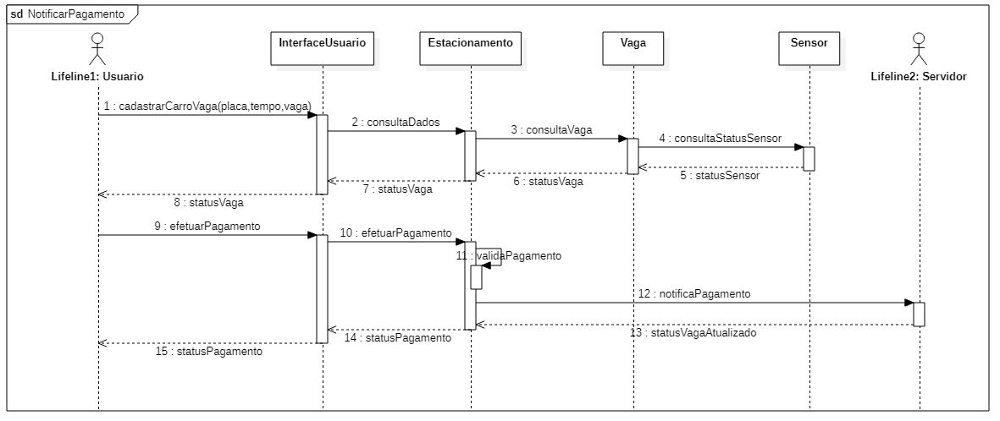

Tabela de conteúdos
=================
<!--ts-->
   * [Requisitos inicias do projeto](#Requisitos-iniciais)  
   * [Leventamento de requisitos](#Requisitos-funcionais)
      * [Requisitos do Servidor](#Requisitos-funcionais-servidor)
      * [Requisitos do Totem](#Requisitos-funcionis-totem)
   * [Regras de negócio](#Regras-de-negócio)
   * [Diagrama de casos de uso](#Diagramas-de-casos-de-uso)
      * [Diagrama de casos de uso lado servidor](#Diagrama-de-casos-de-uso-do-servidor)
      * [Diagrama de casos de uso lado totem](#Diagrama-de-casos-de-uso-do-totem)
   * [Descrição de casos de uso do servidor](#Descrição-de-casos-de-uso-do-sistema-servidor)
   * [Descrição de casos de uso do totem](#Descrição-de-casos-de-uso-do-totem)
   * [Diagrama de classe sistema Servidor](#Diagrama-de-classe-sistema-Servidor)
   * [Diagrama de classe sistema Totem](#Diagrama-de-classe-sistema-Totem)
   * [Diagrama de sequências](#Diagrama-de-sequência-efetuar-pagamento-sistema-Servidor)
   * [Para executar a aplicação Servidor](#Para-executar-a-aplicação-Servidor)
     * [Para acessar a aplicação Servidor](#Para-acessar-a-aplicação-Servidor)
<!--te-->

## Proposta do Projeto da disciplina PJI029006 

<div style="text-align:center">
   
</div>

Sistema de estacionamento "zona azul" para uma cidade.

### Requisitos iniciais:
* Prever a possibilidade de vários totems para cobrir a * cidade toda.
* O usuário pode fazer o pagamento no Totem ou por meio digital usando o smartphone.
* Os sensores podem ser com fio ou sem fio.
* O totem deve prover uma interface de serviço para adição, configuração e remoção de
sensores.
*  O sistema servidor deve:
   * Reportar o número de vagas ocupadas; 
   * Localização de  vagas na cidade;
   * Gerar sinais de alerta para os fiscais; 
   * Informações para usuário sobre o tempo
   decorrido;
   * Gerar alerta de tempo expirado


## Requisitos Funcionais


### Requisitos funcionais servidor:
* **R1.** Servidor de informar o número de vagas ocupadas 
* **R2.** Servidor deve localizar vagas na cidade 
* **R3.** Servidor deve gerar notificações para os fiscais caso haja alguma vaga com tempo excedido
* **R4.** Servidor deve gerar notificação de tempo expirando para o usuário
* **R5.** Servidor deve gerar notificação para o técnico se algum sensor estiver inoperante
* **R6.** Permitir o usuário criar uma conta
* **R7.** Permitir o usuário se autenticar no sistema
* **R8.** Permitir o usuário Cadastrar um veículo
* **R9.** Permitir o usuário Alterar veículo do cadastrado
* **R10.** Permitir o usuário Efetuar pagamento
* **R11.** Permitir o usuário Renovar vaga em uso
* **R12.** Permitir o usuário Verificar tempo decorrido
* **R13.** Permitir o usuário ver histórico de pagamentos
* **R14.** Permitir o fiscal se autenticar no sistema
* **R15.** Permitir o fiscal a verificar status do veículo
* **R16.** Permitir o fiscal gerar notificação de não conformidade para o veículo
* **R17.** Permitir o Totem cadastrar os sensores no servidor
### Requisitos funcionis totem
* **R18.** Permitir o técnico a logar no sistema de manutenção
* **R19.** Permitir o técnico adicionar sensores
* **R20.** Permitir o técnico remover sensores
* **R21.** Permitir o técnico configurar sensores
* **R22.** Permitir o técnico verificar status dos sensores
* **R23.** Permitir o usuário cadastrar veículo na vaga
* **R24.** Permitir o usuário definir o tempo de estacionamento
* **R25.** Permitir o usuário efetuar pagamento
* **R26.** Permitir o servidor consultar status dos sensores 
* **R27.** Permitir o servidor consultar status das vagas

### Requisitos não funcionais
* **RNF00.** Aplicativo deve ser desenvolvido na linguagem Java
* **RNF01.** A interface do usuário deve ser simples e objetiva
* **RNF02.** Os sensores devem ser sem fio

## Regras de negócio.

* **RN00:** Usuário não pode estacionar por mais de 2 horas por dia na mesma vaga
* **RN01:** Usuário só pode cadastrar 1 veículo
* **RN02:** Servidor deve notificar os usuário quando estiver faltando 10 minutos para acabar o seu tempo.
* **RN03:** Servidor deve bloquear o usuário se tiver 3 notificações no período de 1 mês.

## Diagramas de casos de uso

### Diagrama de casos de uso do servidor

<div style="text-align:center">
   
</div>

### Diagrama de casos de uso do totem

<div style="text-align:center">
   
</div>


## Descrição de casos de uso do sistema servidor

### Criar conta (CSU00) 

|  Sumário | Usuário usa o sistema para criar uma nova conta |
|---|---|
|Ator principal   |  Usuário |
|Ator secundrário   |  N/A |
|Pré condição | N/A|
|Fluxo principal   | 1. Usuário abre o aplicativo e escolhe a opção criar conta<br/> 2. Sistema fornece o campo usuário, senha e email para usuário preencher <br/> 3. Usuário preenche os dados e clica em criar  <br/> 4. Sistema válida os dados do usuário <br/> 5. Sistema cria a conta, e o caso de uso termina|
|Regras de negócio | N/A |
|Pós-condições| N/A |
### Cadastrar veículo  (CSU01)

| Sumário| Usuário vai cadastrar o seu veículo no sistema  |
|---|---|
|Ator principal   |  Usuário |
|Ator secundrário   |  N/A |
|Pré condição | Usuário precisa estar logado no sistema |
|Fluxo principal   | 1. Usuário abre o aplicativo e escolhe a opção cadastrar veículo <br/> 2. Sistema irá fornecer o campo placa para usuário preencher <br/> 3. Sistema verifica se o carro já está cadastrado <br/> 4. Sistema cadatra o veículo. Conforme [RN01](#Regras-de-negócio.), só poderá ter um veículo cadastrado, e o caso de uso termina. <br/> |
|Fluxo Exceção(3): Placa já cadastrada | a.  O sistema reporta o fato, e retorna para o passo 2.| 
|Regras de negócio | RN01 |
|Pós-condições| N/A |

### Alterar veículo (CSU02)

| Sumário| Usuário vai alterar o veículo cadastrado no sistema |
|---|---|
|Ator principal   |  Usuário |
|Ator secundrário   |  N/A |
|Pré condição | Usuário precisa estar logado no sistema |
|Fluxo principal   | 1. Usuário abre o aplicativo e escolhe a opção alterar veículo <br/> 2. Sistema irá fornecer o campo nova placa para usuário preencher <br/> 3. Sistema verifica se o carro já está cadastrado <br/> 4. Sistema altera o veículo, e o caso de uso termina. |
|Fluxo Exceção(3): Placa já cadastrada | a.  O sistema reporta o fato, e retorna para o passo 2.| 
|Regras de negócio | N/A |
|Pós-condições| N/A |


### Efetuar pagamento (CSU03)

| Sumário| Usuário vai efetuar pagamento para utilizar uma vaga|
|---|---|
|Ator principal   |  Usuário |
|Ator secundrário   |  N/A |
|Pré condição | Usuário precisa estar logado no sistema e ter um carro cadastrado|
|Fluxo principal   | 1. Usuário abre o aplicativo e escolhe a opção efetuar pagamento <br/> 2. Sistema irá fornecer o campo tempo e a vaga para o usuário preencher <br/> 3. Sistema verifica se a vaga está livre <br/> 4. Usuário escolhe o tempo que deseja estacionar <br/> 5. Sistema atribui o tempo ao carro cadastrado <br/>6. Usuário escolhe a forma de pagamento <br/> 7. Sistema válida o pagamento a atualiza status da vaga, e o caso de uso termina| 
|Fluxo Exceção(3): Vaga ocupada | a.  O sistema reporta o fato, e o caso de uso termina.| 
|Regras de negócio | N/A |
|Pós-condições| N/A |


### Verificar tempo (CSU04)

| Sumário| Usuário deseja verificar quanto tempo ainda tem disponível na vaga|
|---|---|
|Ator principal   |  Usuário |
|Ator secundrário   |  N/A |
|Pré condição | Usuário precisa estar logado no sistema e ter um carro cadastrado|
|Fluxo principal   | 1. Usuário abre o aplicativo e escolhe a opção verificar tempo  <br/> 2. Sistema irá mostrar o tempo que ainda tem disponível ao usuário, e o caso de uso termina <br/>
|Fluxo alternativo(2): Usuário deseja renovar o tempo da sua vaga |a. Sistema fornece a possibilidade do usuário definir um novo tempo para vaga <br/> b. Se o usuário escolher a opção definir tempo, entrará no caso [CSU03](#Efetuar-pagamento-(CSU03))|
|Regras de negócio | N/A |
|Pós-condições| N/A |


### Verificar histórico (CSU05)

| Sumário| Usuário deseja verificar o histórico de estacionamentos realizados|
|---|---|
|Ator principal   |  Usuário |
|Ator secundrário   |  N/A |
|Pré condição | Usuário precisa estar logado no sistema|
|Fluxo principal   | 1. Usuário abre o aplicativo e escolhe a opção verificar histórico <br/> 2. Sistema irá mostrar os dados referente ao seu uso do estacionamento<br/> 3. Sistema fornece a opção de salvar como arquivo <br/> 4. Usuário escolhe salvar ou não o arquivo e o caso de uso termina | 
|Regras de negócio | N/A |
|Pós-condições| N/A |

### Cadastrar sensor na vaga (CSU06)

| Sumário  |  Permite o totem cadastrar um novo sensor em uma vaga  |
|---|---|
|Ator principal   |  Totem |
|Atores secundrários   |  N/A |
|Pré condição | N/A |
|Fluxo principal   | 1. Totem solicita ao servidor a opção de configurar um sensor em uma vaga <br/> 2. Sistema irá solicitar o identificador do sensor e em qual vaga deseja configurar <br/> 3. Sistema verifica se a vaga está disponível<br/> 4. Sistema adiciona o sensor na vaga e o caso de uso termina|
|Fluxo Exceção(3): Vaga já possui um sensor cadastrado | a.  O sistema reporta o fato, e o caso de uso termina.| 
|Regras de negócio | N/A |
|Pós-condições| N/A |


### Atualizar status da vaga  (CSU07)
| Sumário  |  Totem pode alterar sensor ou remover sensor de uma vaga  |
|---|---|
|Ator principal   | Totem  |
|Atores secundrários   | N/A  |
|Pré condição | N/A |
|Fluxo principal   | 1. Totem solicta ao servidor a opção de atualizar status de uma vaga <br/>2. Sistema fornece a opção de alterar um sensor da vaga <br/> 3. Sistema solicita o identificador da vaga <br />4. Sistema verifica se o novo sensor já está cadastrado <br/> 5. Sistema altera o sensor da vaga o caso de uso termina|
|Fluxo Alternativo(2): Totem deseja remover um sensor   | a. Sistema fornece a opção de remover um sensor de uma vaga <br/> b. Sistema solicita o identificador do sensor a ser removido <br/> c. Sistema remove o sensor da vaga, e o caso de uso termina|
|Regras de negócio | N/A |
|Pós-condições| N/A |


###  Verificar situação da vaga (CSU08)
| Sumário  |  Fiscal deseja consultar a situação de uma vaga |
|---|---|
|Ator principal   |  Fiscal |
|Atores secundrários   | N/A  |
|Pré condição | Fiscal precisa estar logado no sistema|
|Fluxo principal   | 1. Fiscal solicita ao servidor a situação atual da vaga <br/> 2. Sistema informa a situação da vaga <br/> 3. Fiscal confirma se a informação está condizente <br/> 4. Sistema atualiza status da vaga caso não esteja de acordo, e o caso de uso termina|
|Regras de negócio | N/A |
|Pós-condições| Confirmar situação vaga |


## Descrição de casos de uso do totem


### Verificar status do sensor (CSU09)
| Sumário  | Técnico verifica um sensor na lista de sensores |
|---|---|
|Ator principal   | Técnico  |
|Atores secundrários   | Sensor |
|Pré condição | Técnico estar logado no sistema |
|Fluxo principal   | 1. Técnico entra no menu de verificar status do sensor <br/> 2. Totem apresenta a lista de sensores <br/> 3. Técnico seleciona o sensor a ser verificado <br/> 4. Totem consulta o sensor para verificar seu status<br/>5. Totem mostra o status do sensor selecionado e o caso de uso termina <br/> |
|Regras de negócio | N/A |
|Pós-condições| N/A |

### Adicionar sensor (CSU10)
| Sumário  | Técnico adiciona um sensor na lista de sensores |
|---|---|
|Ator principal   | Técnico |
|Atores secundrários   | N/A |
|Pré condição | Técnico estar logado no sistema |
|Fluxo principal   | 1. Técnico entra no menu de adicionar sensor <br/> 2. Tecnico insere ID e posição do sensor <br/> 3. Totem verifica se o ID do sensor e a posição já existem <br/> 4. Totem adiciona o sensor na lista de sensores, e o caso de uso termina <br/> |
|Fluxo execção(3): ID ou posição inválida   | a. Totem notifica o ocorrido e o caso de uso termina
|Regras de negócio | N/A |
|Pós-condições| N/A |

### Remover sensor (CSU11)
| Sumário  | Técnico remove um sensor na lista de sensores  |
|---|---|
|Ator principal   | Técnico |
|Atores secundrários   | N/A |
|Pré condição | Técnico está logado no sistema |
|Fluxo principal   | 1. Técnico entra no menu de remover sensor  <br/> 2. Totem apresenta a lista dos sensores ativos no momento <br/> 3. Técnico seleciona o sensor a ser removido<br/> 4. Totem remove o sensor escolhido da lista de sensores, e o caso de uso termina <br/> |
|Regras de negócio | |
|Pós-condições| N/A |

### Configurar sensor em uma vaga (CSU12)
| Sumário  | Técnico configura um sensor na vaga  |
|---|---|
|Ator principal   | Técnico |
|Atores secundrários   | Servidor  |
|Pré condição | Técnico está logado no sistema |
|Fluxo principal   | 1. Técnico entra no menu de configurar sensor <br/> 2. Totem solicita o identificador do sensor e em qual vaga deseja configurar<br/> 3. Técnico informa qual sensor deseja configurar<br/> 4. Totem encaminha a configuração para o servidor <br/> 5. Totem informa se teve sucesso em adicionar o sensor, e o caso de uso termina|
|Regras de negócio | N/A |
|Pós-condições| N/A |


### Cadastrar carro na vaga (CSU13)
| Sumário  | Usuário cadastra seu veículo na vaga |
|---|---|
|Ator principal   | Usuario |
|Atores secundrários   | Servidor|
|Pré condição | N/A |
|Fluxo principal   | 1. Usuário entra no menu de cadastrar veículo <br/> 2. Totem apresenta uma caixa de diálogo para cadastro de veículo contendo placa, tempo a ser utilizado e a vaga <br/> 3. Usuário insere os dados<br/>4. Usuário confirma os dados <br/> 5. Sistema verifica se a vaga está disponpivel <br/> 6. Usuário efetua o pagamento <br/> 7. Totem válida o pagamento <br/> 8. Totem notifica o servidor sobre o pagamento, e o caso de uso termina <br/> |
|Fluxo de exceção:(5): Vaga já está ocupada| a. Totem notifica o servidor pra verificar se a vaga realmente está ocupada |
|Regras de negócio | N/A |
|Pós-condições| Notificar pagamento da vaga |

### Notificar pagamento da vaga  (CSU14)
| Sumário  | O sistema notifica o servidor que a vaga foi paga(caso de uso interno) |
|---|---|
|Ator principal   | Totem  |
|Atores secundrários   | Servidor |
|Pré condição | N/A |
|Fluxo principal   | 1. Totem notifica o servidor que o usuário efetuou o pagamento para uma vaga <br/> 2. Totem aguarda confirmação do Servidor <br/> 3. Totem notifica a resposta do servidor ao usuário, e o caso de uso termina| 
|Regras de negócio | N/A |
|Pós-condições| N/A |

###  Consultar vaga (CSU15)
| Sumário  | Servidor mostra vagas disponiveis  |
|---|---|
|Ator principal   | Servidor |
|Atores secundrários   | Sensor |
|Pré condição | Sensores do Totem cadastrados no servidor |
|Fluxo principal   | 1. Servidor requisita informação sobre o sensor da vaga ao Totem <br/> 2. Totem consulta informação do sensor cadastrado na vaga<br/> 3. Totem nofica o servidor sobre o status do sensor, e o caso e uso termina |
|Regras de negócio | N/A |
|Pós-condições| N/A |


### Diagrama de classe sistema Servidor

<div style="text-align:center">
   
</div>

### Diagrama de classe sistema Totem

<div style="text-align:center">
   
</div>

### Diagrama de sequência efetuar pagamento sistema Servidor

<div style="text-align:center">
   
</div>

### Diagrama de sequência notificar pagamento sistema Totem

<div style="text-align:center">
   
</div>

### Para executar a aplicação Servidor

O ideal é fazer uso do Python Virtualenv, mas seria possível executar a aplicação sem ele. Basta instalar os pacotes que estão no arquivo [requirements.txt.](ZonaAzul/Servidor/requirements.txt)

```shell
python3 -m venv venv
source venv/bin/activate

# para instalar os pacotes. Só é necessário fazer isso uma única vez
pip install -r requirements.txt

# para executar a aplicação
python3 app.py

```

### Para acessar a aplicação Servidor

No navegador web entre com o endereço `http://localhost:5000`. O banco conta com um usuário para teste

| Usuário | Senha |
| ------- | -----|
| renaner    | 123456 |

### Cadastrando vagas no servidor

Servidor possui rotas ao qual o sistema Totem pode cadastrar as vagas que estão com sensor configurados. Para cadastrar, é necessário enviar uma requisição POST contendo as informações da vaga na URL http://127.0.0.1:5000/vagas. Abaixo um exemplo de Json a ser enviado.

```json
{
	"vagas": [
			{
			"idVaga" : 1,
			"idSensor" : 11
			},
			{
			"idVaga" : 2,
			"idSensor" : 12
			},
		{
			"idVaga" : 3,
			"idSensor" : 13
			},
		{
			"idVaga" : 4,
			"idSensor" : 20
			},
		{
			"idVaga" : 5,
			"idSensor" : 25
			}
	]
}


```

Para testar essa funcionalidade, pode-se também usar o Curl com o seguinte comando

```shell
curl -X POST http://127.0.0.1:5000/vagas -H "Content-Type: application/json" -d '{"vagas": [{"idVaga" : 1,"idSensor" : 11},{"idVaga" : 2,	"idSensor" : 12},{"idVaga" : 3,"idSensor" : 13},{"idVaga" : 4,"idSensor" : 20	},{"idVaga" : 5,"idSensor" : 25}]}'
```
### Alterando status e sensor de uma vaga

Sistema servidor também permite o sistema Totem fazer alterações de status e de sensor configurado em um determina vaga. Abaixo um exemplo de Json a ser enviado para:

Alterar status. Usar URL http://127.0.0.1:/vagas/status com o corpo Json abaixo

```json
{
	"idVaga" : 1,
	"status": true
}
	
```
Alterar sensor. Usar URL http://127.0.0.1:/vagas/sensor com o corpo Json abaixo
```json
	{
	"idVaga" : 4,
	"idSensor": 99
	}

```

Caso queria testar sem o sistema totem, pode se usar o CURL conforme abaixo.


```shell
curl -X POST http://127.0.0.1:5000/vagas/status -H "Content-Type: application/json" -d '{"idVaga" : 1,"status": true}'

```

```shell
curl -X POST http://127.0.0.1:5000/vagas/sensor -H "Content-Type: application/json" -d '{"idVaga" : 1,"idSensor": 99}'

```
